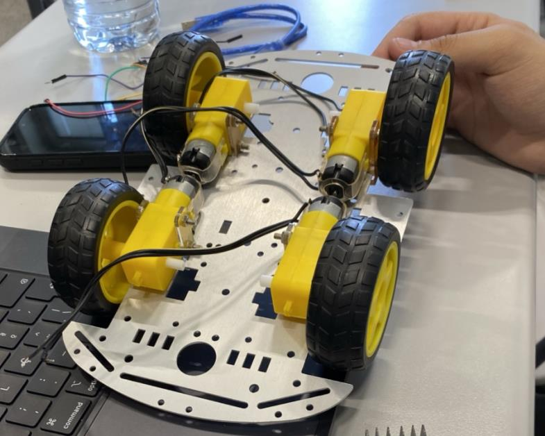
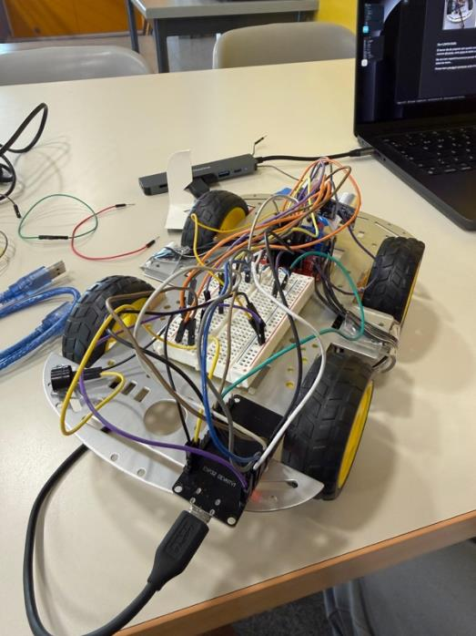
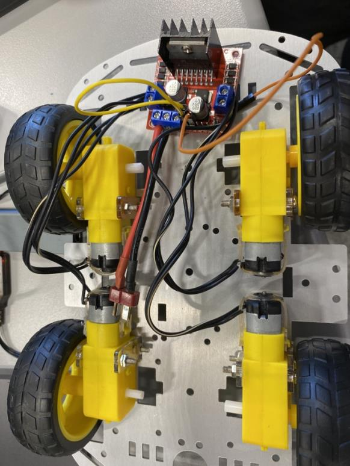
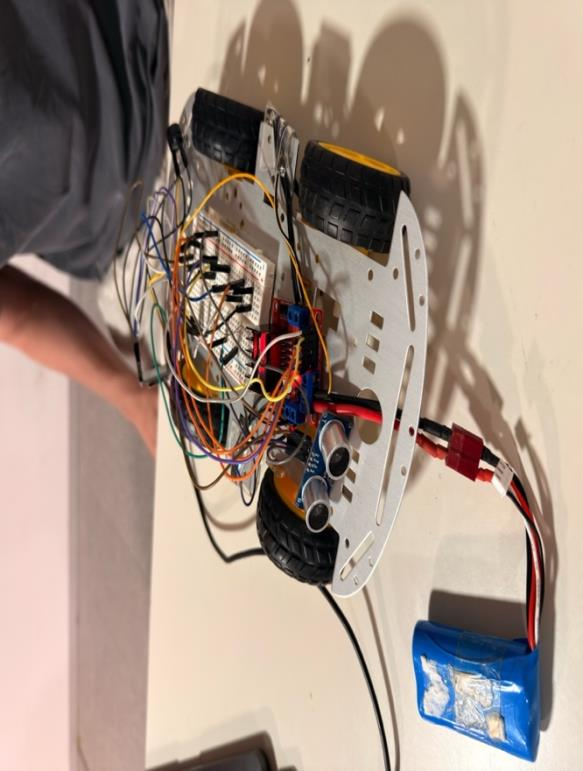

# Remote Robot Car

Four wheel ESP32 robot controlled from a phone over MQTT with autonomous ultrasonic obstacle protection.

## Real build

| Assembly | Wiring | Final car |
| --- | --- | --- |
|  |  |  |

## System

The ESP32 receives eight plain text MQTT commands through `broker.emqx.io`. An L298N bridge drives four DC motors with PWM speed levels. An HC SR04 sensor runs on a short cycle and requires repeated close readings before it overrides motion, stops the car, reverses and warns through the buzzer.

## Hardware

ESP32, L298N motor driver, four DC motors, HC SR04 ultrasonic sensor, buzzer, 12 V battery and phone hotspot.

## Run

Install the PubSubClient Arduino library. Replace `YOUR_WIFI_SSID` and `YOUR_WIFI_PASSWORD` in `RemoteRobotCar.ino`, flash the ESP32 and publish commands to `casa/esp32/car`.

Commands: `forward`, `back`, `left`, `right`, `slow`, `normal`, `fast`, `turbo`.

## Demo

[Watch the real car](https://youtu.be/cBed9lY9uKQ)

## CA

Cotxe robot ESP32 controlat per MQTT amb quatre velocitats, vuit ordres i protecció autònoma d'obstacles.

## ES

Coche robot ESP32 controlado por MQTT con cuatro velocidades, ocho comandos y protección autónoma de obstáculos.
